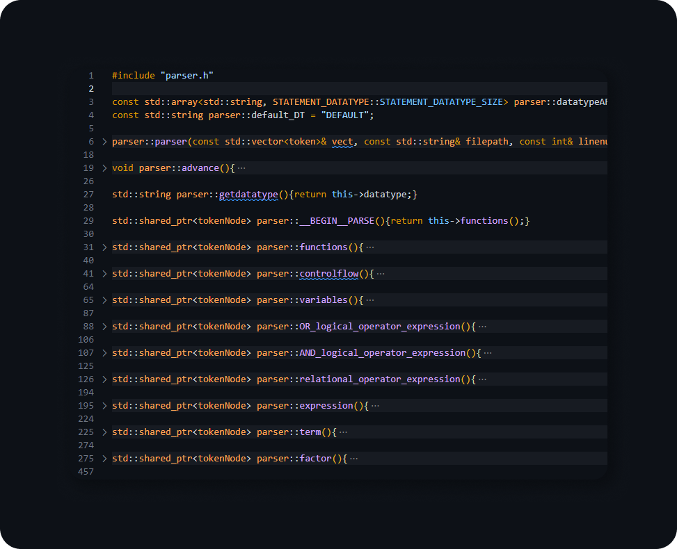

# Interpreter
A basic and my first attempt at making an interpreter which interprets and executes a program line by line

# Presentation

# Inspirations, Sources and References
 1. https://craftinginterpreters.com/
 2. https://www.youtube.com/playlist?list=PLZQftyCk7_SdoVexSmwy_tBgs7P0b97yD
 3. https://ruslanspivak.com/lsbasi-part1/

# Implemented features
 1. numbers and strings
 2. operations which can be performed between numbers and strings(logical, relational etc)
 3. variables
 4. printing to the console
 5. control flow( if statements, while loops and for loops)
 6. functions (currently being implemented)

# Language Rules
 language rules can be found under <a href="https://github.com/waveyboym/Interpreter/blob/main/RULES/langrules.txt">RULES/langrules.txt</a>

# Documentation
  Access the documentation here:
  Or by accessing this folder: <a href="https://github.com/waveyboym/Interpreter/blob/main/DOCS/">DOCS</a>
